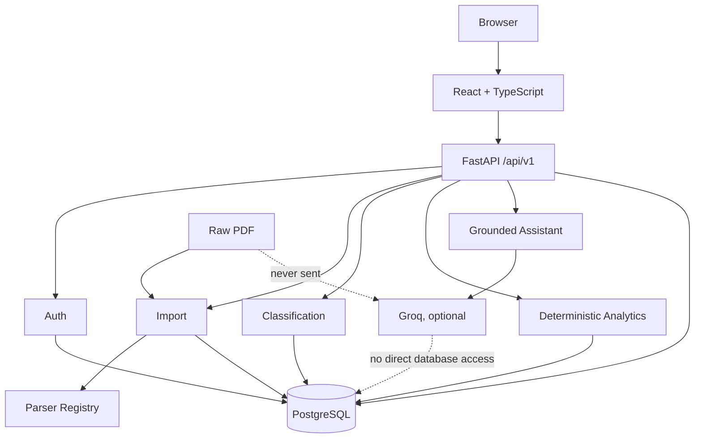

# FinSight

FinSight V1 is a secure, bank-agnostic personal spending intelligence platform whose first supported source is a manually uploaded Yapı Kredi TLcard PDF statement. It turns reviewed statement rows into a canonical financial record, deterministic analytics, and an optional grounded assistant without presenting itself as a live bank-account aggregator.

**Release:** `1.0.0` · **Status:** Phase 10 production-readiness implementation awaiting review. Phases 0–9 are frozen.

## What FinSight does

```text
Register or log in → create a local FinSight account → upload a statement
→ preview and reconcile → resolve possible duplicates → confirm transactions
→ deterministic categorization and analytics → review/correct classifications
→ optionally ask the grounded Groq assistant
```

- Authenticates users with short-lived bearer access tokens and rotating, revocable HttpOnly refresh sessions.
- Parses text-layer Yapı Kredi TLcard e-statements behind a bank-specific adapter.
- Keeps preview candidates in database-backed staging and creates no canonical transaction before confirmation.
- Reconciles statement totals, flags exact-file and transaction-level duplicates, and confirms atomically.
- Classifies transactions with deterministic rules and preserves an explicit review state.
- Presents imported spending by category, merchant, month, and separate currency, plus a bounded run-rate estimate.
- Lets users search transactions and correct merchant/category classification.
- Optionally explains deterministic tool results through Groq with strict identity, tool, data-minimization, and numeric-grounding boundaries.

## Why it exists

Monthly statement PDFs are useful records but poor analytical interfaces. FinSight provides a reviewable path from provider-specific documents to a provider-independent model. The core remains ready for future adapters without moving bank rules into analytics, the frontend, or the assistant.

## Architecture

FinSight is an API-first modular monolith. FastAPI owns authentication and all financial behavior; PostgreSQL is the canonical store; React is presentation only.



The frozen engineering contract is [AGENTS.md](AGENTS.md). Architecture, domain, import boundaries, roadmap, and ADRs live in [docs/](docs/). Historical phase reports record the reviewed implementation sequence.

## Financial semantics

- Amounts use the account perspective: money entering is positive and money leaving is negative.
- Authoritative Python amounts are `Decimal`; PostgreSQL uses `NUMERIC(18,2)`.
- Currency is explicit. V1 never combines unlike currencies and performs no FX conversion.
- Expense contributes to consumer spending; refund reduces net spending.
- Transfer, card payment, and income are excluded from consumer spending. Cash withdrawal and fees are reported separately. Unknown remains explicit.
- Analytics use canonical confirmed transactions and calendar transaction dates. Staging candidates never enter analytics.
- Installment analytics use the canonical monthly cash-flow row, not an invented original purchase value.
- The month-end figure is a simple estimate from observed imported activity, never a balance, income forecast, or guaranteed remaining cash.

## AI safety architecture

The optional assistant can understand a question, choose from seven approved application tools, and explain their output. Deterministic backend services calculate every authoritative total. The model has no direct database connection, no arbitrary SQL capability, and no ability to choose `user_id`. Account scope is checked against the authenticated user before provider contact.

Raw PDFs, extracted statement text, internal identifiers, and raw transaction descriptions are not sent to Groq. Assistant messages and the limited derived financial data returned by an approved tool may be sent when Groq is enabled. Numeric grounding checks the final answer against tool results and repairs or replaces unsupported claims. Questions about current balance, net worth, or remaining cash receive an explicit limitation.

## Security architecture

- Argon2id password hashes and canonicalized email identifiers.
- Signed short-lived access tokens kept only in memory by the browser client.
- Opaque refresh token in a scoped HttpOnly, SameSite cookie; stored refresh values are SHA-256 hashes and rotate on use.
- Database-backed session revocation and user-scoped access on every financial query.
- Exact credentialed CORS allowlist and Origin checks on refresh/logout.
- Production fail-fast checks for placeholder JWT secrets, insecure refresh cookies, unsafe origins, and malformed database URLs.
- Upload byte/page bounds, file-signature checks, temporary parsing, and no raw-PDF persistence.
- Bounded assistant input, history, provider calls, tool loops, tool arguments, and transaction search results.

This is practical V1 application security. The in-process authentication rate limiter and Compose template do not replace an edge rate limiter, TLS ingress, managed secret store, monitoring, or managed database controls.

## Tech stack

| Layer | Technology |
| --- | --- |
| API | Python 3.12, FastAPI, Pydantic Settings |
| Data | PostgreSQL 17, SQLAlchemy 2, Psycopg 3, Alembic |
| Parsing | pypdf with a strict text-layer statement adapter |
| Auth | PyJWT, pwdlib/Argon2id, database-backed refresh sessions |
| Web | React 19, TypeScript, React Router, TanStack Query, Recharts, Vite |
| Production containers | Python slim, unprivileged Nginx static runtime, Docker Compose template |
| Quality | pytest, Ruff, Vitest, Testing Library, TypeScript, GitHub Actions |

Python 3.12 is the canonical and only supported V1 backend minor version (`>=3.12,<3.13`). Node.js 24 is used in Docker and CI; local tooling requires Node.js 22.12 or later.

## Local development

Prerequisites are Docker Desktop with Linux containers and Docker Compose. Copy the example and replace both placeholders with local-only random values:

```powershell
Copy-Item .env.example .env
docker compose up --build
```

On macOS/Linux use `cp .env.example .env`. The local services are:

- Web: <http://localhost:5173>
- API docs: <http://localhost:8000/api/v1/docs>
- Health: <http://localhost:8000/api/v1/health> → `{"status":"ok"}`
- Liveness: <http://localhost:8000/api/v1/health/live>
- Readiness: <http://localhost:8000/api/v1/health/ready>
- PostgreSQL from the host: `127.0.0.1:55433`

Inside Docker the backend always connects to `postgres:5432`. `POSTGRES_HOST_PORT=55433` controls only localhost publication; host-run Python/Alembic uses `POSTGRES_HOST=127.0.0.1` and `POSTGRES_PORT=55433`. Every published development port is bound to localhost.

The local Compose file intentionally uses the Vite development server and automatic migration startup. Stop it with `docker compose down`; add `-v` only when deliberately deleting the local database volume.

## Production configuration

Production uses [backend/Dockerfile.prod](backend/Dockerfile.prod), [frontend/Dockerfile.prod](frontend/Dockerfile.prod), and the optional [docker-compose.prod.yml](docker-compose.prod.yml) template. The frontend build is served by unprivileged Nginx with SPA fallback, immutable caching only for hashed assets, and no-cache HTML. The API runs as a non-root user under Uvicorn without reload or development dependencies.

The release sequence runs `alembic upgrade head` once in a migration job before API replicas start. The production Compose template expresses this dependency and does not publish PostgreSQL. It defaults application ports to localhost and expects a real TLS ingress for public use.

Read [ENVIRONMENT.md](ENVIRONMENT.md) before deploying and [OPERATIONS.md](OPERATIONS.md) for startup, health, logging, backup/restore, secret rotation, and troubleshooting. The browser-visible API URL is a frontend build input; changing it requires a new frontend image. No secret is baked into either image.

## Testing

With the development services running:

```sh
docker compose exec -T backend pytest
docker compose exec -T backend ruff check .
docker compose exec -T backend ruff format --check .
docker compose exec -T backend alembic upgrade head
docker compose exec -T backend alembic current
docker compose exec -T backend alembic check
docker compose exec -T frontend npm test -- --run
docker compose exec -T frontend npm run typecheck
docker compose exec -T frontend npm run build
docker compose config --quiet
```

Backend tests use real PostgreSQL and create randomly named disposable test databases. They require a non-production role with `CREATEDB`, apply real migrations, and remove the databases afterward. Tests never use production credentials. Test and evaluation data is synthetic. The suite covers the complete authenticated flow, two-user isolation, import atomicity/concurrency, canonical semantics, categorization, analytics, assistant grounding, auth abuse cases, production configuration, and OpenAPI exclusions.

GitHub Actions repeats pinned backend checks with PostgreSQL, frontend tests/typecheck/build, Compose validation, and both production image builds. CI does not use Groq, publish images, deploy, or contain real secrets.

Playwright was not added for V1 because the existing authenticated backend acceptance flow and React integration suites already exercise the full product boundary; adding and maintaining a browser runtime solely for duplicate coverage would add disproportionate orchestration. Phase 10 also records a manual browser-emulation pass at 1440, 1024, 768, and 390 pixels.

## Privacy

Uploaded statements are parsed temporarily by FinSight. Raw PDF bytes and extracted full-statement text are not persisted or sent to Groq. The product stores canonical transactions and minimal provenance needed for reconciliation and idempotency; it does not store customer name, address, or full account/card number from a statement.

Imported coverage may be incomplete. FinSight does not connect directly to a bank. If the optional assistant is enabled, the user's assistant message and limited derived tool data needed for the answer may be sent to Groq. Hosted deployments must provide their own clear operational privacy controls and must not invite real banking data without an appropriate security review.

## V1 limitations

- The only supported source is a manually uploaded text-layer Yapı Kredi TLcard PDF.
- Imported activity can be incomplete and is not a complete account history.
- There is no current bank balance, available credit, net worth, budget planning, or investment tracking.
- There is no Open Banking, direct bank connection, Gmail ingestion, CSV/XLSX import, OCR, or background ingestion.
- The Groq assistant is optional and operates only through approved FinSight tools.
- There is no model-generated SQL, RAG, embeddings, or autonomous financial agent.
- There is no currency conversion or aggregation across currencies.
- The production Compose file is a deployment template; production TLS, durable monitoring, alerting, secret management, and backup automation remain operator responsibilities.

## Roadmap

V1 ends with Phase 10. Future versions may add more statement adapters and ingestion channels while preserving the canonical import boundary. Ziraat, CSV/XLSX, Gmail ingestion, Open Banking, native clients, and other post-V1 capabilities are intentionally absent.

## Screenshots

Repository screenshots are intentionally omitted from V1. Product verification uses ephemeral synthetic accounts in browser emulation, preventing personal emails, UUIDs, credentials, or financial records from becoming repository artifacts.

## Contributing and license

Follow [CONTRIBUTING.md](CONTRIBUTING.md): each reviewed phase receives one final commit, existing history is not rewritten, and sensitive financial artifacts are never staged. This repository currently has no license file; no reuse license has been selected by the owner.
